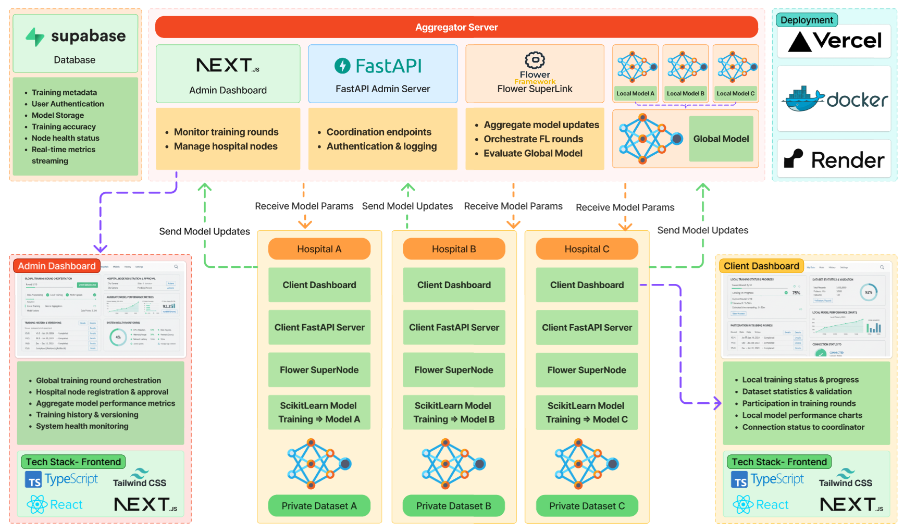

# Federated Learning Orchestration

Federated learning orchestration stack built on Flower (flwr) with Supabase-backed persistence. 
The repository hosts two FastAPI services that manage Flower SuperLink/SuperNode processes, store run metadata and logs, and expose APIs used by frontend dashboards.

## Overview
- Flower SuperLink controls global training rounds; SuperNodes handle local model updates.
- Supabase stores projects, nodes, node sessions, run metadata, log streams, and aggregated metrics.
- Admin server controls SuperLink lifecycle and federated runs.
- Client server manages SuperNode instances deployed at participant sites.
- Flower app reads the active run identifier from `flower-app/pyproject.toml` to push telemetry without environment overrides.

## Repository layout
- `admin-server/` – FastAPI service for orchestrating SuperLink and runs.
  - `utils/config.py` – environment-driven settings.
  - `utils/constants.py` – shared paths and log file constants.
  - `utils/supabase.py` – async Supabase wrapper used across managers.
  - `utils/schemas.py` – request models for API endpoints.
  - `utils/process_manager.py` – lifecycle management for SuperLink and training runs.
  - `logs/` – runtime log directory (created on demand).
- `client-server/` – FastAPI service for managing SuperNodes (mirrors admin structure).
- `flower-app/` – Flower application that executes local training workloads.
- `db/schema.sql` – Supabase schema for projects, nodes, sessions, and runs.
- `frontend/` – Next.js dashboard for administrators and participants.

## Services and endpoints

### Flower application (`flower-app/`)
- Flower client (`flower-app/flower_app/client_app.py`) and server application (`flower-app/flower_app/server_app.py`) that runs federated learning workloads.

- Server app contains the federated learning strategy and model aggregation logic.

- Client app handles local training and evaluation logic.

### Admin server (`admin-server/main.py`)
- `GET /health` – reports SuperLink state, active run info, and project id.

- `POST /superlink/start` – launches Flower SuperLink. Request body: `SuperlinkStartRequest` (fields: `insecure`, `certificates_path`, `listen_address`, `extra_args`).

- `POST /superlink/stop` – terminates the running SuperLink process.

- `POST /runs/start` – initiates a federated run. Request body: `RunStartRequest` (`federation_name`, `stream`, `extra_args`).

- `POST /runs/stop` – stops the active federated run and clears the run id in `pyproject.toml`.

- `GET /runs/active` – returns details about the currently running federation.

### Client server (`client-server/main.py`)
- `GET /health` – indicates SuperNode process state, start time, log path, session id, and project id.

- `POST /supernode/start` – starts a Flower SuperNode process. Request body: `SupernodeStartRequest` (defined in `client-server/utils/schemas.py`).

- `POST /supernode/stop` – stops the SuperNode process and updates Supabase session state.

### Frontend dashboard
- Admin dashboard at `http://localhost:3000/admin` to monitor projects, nodes, runs, and logs.
- Participant dashboard at `http://localhost:3000/participant` to view node status and run progress.


### Persistence and logging
- Supabase tables (`projects`, `nodes`, `node_sessions`, `federated_runs`) hold configuration, lifecycle events, log streams, and metrics.

- Process stdout/stderr is streamed to local files under `logs/` (`superlink.log`, `run.log`) and appended to the relevant Supabase records.

- When a federated run starts, the generated `run_id` is stored in `flower-app/pyproject.toml` under `[tool.flwr.app.config]` as `current-run-id`, enabling the Flower telemetry pipeline to associate metrics with that run.

## Running the backend services 

1. Setup Flower:

```bash
python -m venv .venv

.\.venv\Scripts\Activate.ps1

python -m pip install flwr

cd flower-app

pip install -e .
```


2. Setup rest of the services:

```bash

# install dependencies
pip install -r requirements.txt

# start admin server (port 8000 by default)
cd .\admin-server
python .\main.py

# start client server (port 8001 by default)
cd ..\client-server
python .\main.py

```

SuperLink, SuperNodes, and Flower runs are started or stopped through the HTTP APIs described above.

## Environment variables

```bash
SUPABASE_URL= # Supabase REST endpoint.
SUPABASE_KEY= # Supabase key (service or anon).
PROJECT_SLUG= # project identifier stored in Supabase (`fed-project` default).
PROJECT_NAME= # display name for the project (`Federated Project` default).
COORDINATOR_NODE_ID= # external id for the coordinator node.
COORDINATOR_NODE_NAME= # display name for the coordinator node.
PARTICIPANT_NODE_ID= # external id for the participant node.
PARTICIPANT_NODE_NAME= # display name for the participant node.
ADMIN_CORS= # comma-separated list of allowed origins for CORS middleware (defaults to `*`).

```


## Running the frontend dashboard

1. Navigate to the `frontend/` directory.
2. Set up environment variables by creating a `.env` file with the following content:

```bash
NEXT_PUBLIC_SUPABASE_URL= # Supabase REST endpoint.
NEXT_PUBLIC_SUPABASE_ANON_KEY= # Supabase anon key.
SUPABASE_ADMIN= # Supabase admin key.
RESEND_API_KEY= # Resend API key. (https://resend.com/)
RESEND_DOMAIN= # Resend domain.

NEXT_PUBLIC_APP_NAME=FedML
NEXT_PUBLIC_APP_ICON='/logos/fedml.webp'

NEXT_PUBLIC_ADMIN_SERVER_URL=http://127.0.0.1:8000 # Admin server URL.

```

3. Install dependencies:

```bash
npm install
```
3. Start the development server:

```bash
npm run dev
```
4. Open your browser and go to `http://localhost:3000/admin` to access the dashboard


## Architecture
See the included architecture diagram for the full end-to-end flow. At a high level, Supabase stores metadata and telemetry, the admin server orchestrates training rounds via Flower SuperLink, client servers manage hospital SuperNodes, and frontend dashboards (Next.js) will surface health and metrics for both administrators and participants.


